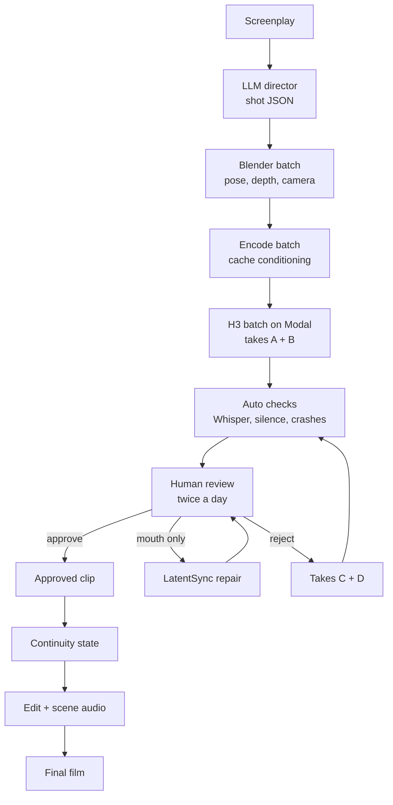

# Studio Film & Series Module — Subplan

Sep 25, 2026 · @Jean-Pierre

## Place in the studio plan

This module adds long-form film and series production to the existing studio as 11 validated flow blocks plus one composite "Film / Series" flow. The first production run is our own monthly 20-minute series, which doubles as the module's showcase.

**Development process (unchanged from the studio)**


Each feature below is one brief and one PR. A feature is merged only when its acceptance test passes on the fixed test set: the same short scene, characters and seeds every time, so results compare across versions.

**Compute model**

- Clients run everything on their own Modal account; the studio stores and uses their tokens securely and never shares jobs across accounts.
- Weights (\~60GB) download to each client's Modal volume from Hugging Face under the client's own licence acceptance; the studio never redistributes them.
- Modal's $30 monthly free credit covers roughly 2–5 minutes of finished film: good for trials, while production users pay Modal directly.
- Our own series follows the same model: development on the 4090, production on our Modal account.

**Module deliverables**

| Deliverable | Used by |
| --- | --- |
| 11 standalone flow blocks (features 1–10, 12) | Any studio client, e.g. lip-sync repair or dubbing alone |
| Composite "Film / Series" flow (feature 11) | Clients producing films or series |
| Our 20-minute monthly series | Revenue and showcase for the module |
| Review labels and judge (feature 12) | Reduces review time for all clients |

The rest of this subplan keeps the technical detail each feature brief draws on: hardware, references, phases, compute, licence and business.

## What changed from v1

The architecture stays: canonical references on every shot, Blender control, two takes, bounded retries, human escalation. What changes: the pipeline is now a module of the studio, built as 12 AI-developed, client-tested features; clients run it on their own Modal accounts; a human reviews twice a day as the guaranteed quality gate; and a lip-sync repair stage saves takes that fail only on the mouth.

| Area | v1 | v2 |
| --- | --- | --- |
| Memory | Assumed H3 + ControlNet fits | Explicit budget: INT8 ConvRot Lite, one model family loaded at a time, stages run sequentially |
| References | Full master pack every shot | Per-shot budget within H3's 9-image / 12-file limit |
| Continuity | Previous frame as a Ref2VA reference | Scene master anchors coverage; true first frame where needed |
| Review | AI judge decides, human for failures | Human reviews twice a day; the judge learns from those decisions and takes over gradually |
| Lip-sync failures | Regenerate | Repair with LatentSync first, regenerate only if repair fails |
| Audio | Per-shot H3 audio kept | Clean dialogue per shot or per scene; ambience, SFX and music built per scene in post |
| Compute | 4090 for production, Modal for overflow | 4090 for development and tests, Modal for the 5-minute test and production |
| Resolution | "Polished" implied 2K | Generate at 768p class, upscale approved shots in post |
| LTX-2, Colab, Kaggle | In week 4 | LTX-2 only for multi-keyframe shots after the 60-second test; Colab/Kaggle dropped |
| Timeline | 4 weeks | About 8–10 weeks to the first 20-minute film; 2–3 weeks per later film |
| Delivery | Standalone pipeline built phase by phase | Studio module: 12 feature PRs, each validated by a client test before merge |

## Quality assessment

H3 is a frontier-level model, not just the best open one, and this pipeline's best-of-takes selection means the audience only sees approved takes. Expect most shots to be genuinely good; remaining flaws should cluster in a few hard shot types.

**Blind-vote rankings, video with audio** ([text-to-video](https://artificialanalysis.ai/video/leaderboard/text-to-video), [image-to-video](https://artificialanalysis.ai/video/leaderboard/image-to-video), checked 25 Sep 2026)

| Model | Open weights | Text-to-video Elo | Image-to-video Elo |
| --- | --- | --- | --- |
| Gemini Omni Flash | No | 1233 | 1177 |
| Wan 3.0 | — | 1229 | — |
| MiniMax H3 Max (fal post-train) | Promised | 1227 | 1195 |
| MiniMax H3 | Yes | 1220 | 1181 |
| Seedance 2.0 720p | No | 1210 | 1174 |
| LTX-2.5 Fast | Yes | 1055 | 1037 |

H3 sits within about 13 points of the top closed model and leads the open-weight field by 150+ points. LTX-2.5 is far enough behind that it should stay a specialist for multi-keyframe shots, not a second main engine.

**Known weak points to test for**

- No published failure rates for identity consistency, lip-sync or non-English dialogue ([Kingy review](https://kingy.ai/news/minimax-h3-benchmarks-specs-hardware-review/)).
- Users report eye flicker, face softness, deformation during image-plus-audio lip-sync, and pixelated distant faces ([Virse](https://www.virse.ai/blog/minimax-h3-reddit-review)).
- Two-person dialogue: mouths can sync while emotional emphasis lands on the wrong character.
- Local output is 768p class; 2K is hosted-only.

**Why the pipeline compensates**

- Canonical references and ControlNet raise the per-take success rate.
- Best-of-2 to best-of-4 selection hides per-take failures: a shot type that fails 40% of the time still usually yields a good take.
- Lip-sync repair (Phase 7) fixes the most common dialogue failure without regenerating.

**Ratings**

| Measure | Rating |
| --- | --- |
| Plan and architecture | 9 / 10 |
| Chance of polished 20-minute episodes (after licence approval) | 8.5 / 10 |
| Business model (series + studio module) | 8–8.5 / 10 |

Every major technical gap now has a known solution to test: hybrid first-frame conditioning, driving audio for dialogue, lip-sync repair, character LoRAs and a hosted 2K option. The hardest remaining shots are two-person dialogue in one frame and wide shots with distant faces. The 60-second test replaces these estimates with measured failure rates.

## Licence and commercial use

Getting MiniMax's authorization is step 0 of the plan. The default H3 Community License covers the world except the EU, UK, South Korea and the US, so running the open weights from France, on the 4090 or on Modal, needs separate authorization ([licence text](https://huggingface.co/MiniMaxAI/MiniMax-H3/raw/main/LICENSE)). This is a plain reading of public documents, not legal advice.

**How to apply**

- Use the [H3 licence request form](https://platform.minimax.io/h3-license), or email api@minimax.io with the subject "MiniMax H3 licensing - authorization request".
- One user reports approval in under ten minutes, apparently automatic ([CompanionLink](https://www.companionlink.com/blog/2026/09/how-to-use-minimax-h3-in-us-or-eu-the-minimax-h3-license-explained/)).
- Keep the approval message on file, and read it: an individual authorization can add conditions beyond the Community License.
- Paid alternative: MiniMax commercial licences sold through [Comfy](https://comfy.org/minimax/license/).

**Commercial terms once authorized**

| Term | What it means for the film |
| --- | --- |
| Revenue cap | Free commercial use while your yearly revenue is under $20M; above that, separate written authorization |
| Attribution | "MiniMax H3" must be displayed prominently; for a film, put it in the credits and in platform descriptions |
| Outputs | Yours to use and sell; you also carry the liability, with no indemnity from MiniMax |
| Acceptable use | Follow MiniMax's Acceptable Use Policy and local law |
| Model training | Outputs may not be used to improve other AI models |
| Governing law | Hong Kong |

**Other legal points for distribution**

- **Avoid recognisable characters, franchises and real people.** MiniMax is in copyright litigation with Hollywood studios, and the liability for outputs is yours.
- **Label the film as AI-generated.** The EU AI Act's transparency rules require AI-generated or manipulated video to be disclosed; for clearly artistic works, a disclosure in the credits or description is generally enough. Confirm current guidance before release.
- **Copyright in AI output is limited.** Your screenplay, character designs, editing and sound mix are your strongest protected work; purely generated frames may carry weaker protection.
- **Check each festival's and platform's AI rules** before submitting.
- **Other components:** check the licences of LatentSync, MuseTalk, any LoRAs and the upscaler before commercial release.

**Studio clients**

- **Each client needs their own H3 licence.** Clients in the EU, UK, US or South Korea need MiniMax's authorization; Modal's servers are mostly in the US, also an excluded territory. Feature 1 includes this as an onboarding gate.
- **Show "MiniMax H3"** in the studio interface wherever the module is used, and bind users to the licence's use restrictions in the studio terms.
- **Get MiniMax's written confirmation** that clients running H3 through the studio on their own Modal accounts is allowed. Commercial licences sold through Comfy exclude inference-as-a-service and model-routing platforms, so don't rely on assumptions.
- **Check every other component** for commercial SaaS use: LatentSync, MuseTalk, turbo and turnaround LoRAs, community ComfyUI nodes, voice-cloning tools and the upscaler.

## Hardware budget: RTX 4090 + 64GB RAM

System RAM, not VRAM, is the tightest constraint. At least one user with exactly this setup reports a MemoryError loading the default Ref2VA workflow ([Comfy-Org discussion](https://huggingface.co/Comfy-Org/MiniMax-H3/discussions/29)), and a 5090 benchmark saw 78–93GiB RAM peaks ([wan2-7.io](https://wan2-7.io/blog/minimax-h3-local-requirements/)). The fix is to never hold the text encoder, the video model and the ControlNet in RAM at the same time.

**Model choices**

| Component | Choice | Size | Note |
| --- | --- | --- | --- |
| H3 transformer | [INT8 ConvRot Lite](https://huggingface.co/DmitryDB/MiniMax-H3-ComfyUI-Quants) (Ref2VA + FL2VA) | 20.3 GiB | Fully resident on a 4090 with \~2 GiB free |
| Fallback transformer | W8/W4 ConvRot | 13.6 GiB | Leaves room for the ControlNet in VRAM; test the quality cost |
| ControlNet | [Fun ControlNet Union](https://huggingface.co/alibaba-pai/MiniMax-H3-Fun-Controlnet-Union) | \~6.8 GB | Will partially offload next to the Lite INT8 model |
| Text encoder | INT8/FP8 build, never NVFP4 | — | NVFP4 is emulated on Ada with no speed gain ([guide](https://minimaxh3.app/posts/minimax-h3-vram-requirements)) |
| Speed LoRA | Lightning / turbo LoRA | — | For drafts and benchmarks; test whether it hurts dialogue |

**Memory rules**

1. **Encode, then unload.** Run prompt and reference encoding for a batch of shots, cache the conditioning to disk, unload the text encoder, then sample. Takes A and B share the same conditioning, so encoding happens once per shot.
2. **One heavy process at a time.** Blender renders, the judge models and H3 never run concurrently. The LLM director runs through an API, not locally.
3. **Swap as a safety net.** 64–96GB of swap or pagefile on NVMe, so a peak slows down instead of crashing.
4. **Everything on NVMe.** The model set is roughly 53GB plus the ControlNet.
5. **Linux preferred.** Stock ComfyUI flags first; most memory flags make a 4090 slower ([InstaSD](https://www.instasd.com/post/comfyui-vram-offloading-guide)). If VAE decode crashes, try `--disable-pinned-memory` and `--disable-async-offload` ([issue #15337](https://github.com/Comfy-Org/ComfyUI/issues/15337)).
6. **Restart ComfyUI between batches** (for example every 20 generations) to clear fragmentation. A Windows report shows GPU loss after repeated H3 runs with 64GB visible ([issue #15488](https://github.com/Comfy-Org/ComfyUI/issues/15488)); it was on Blackwell, but watch for it.

Because production runs on Modal, 64GB is enough for development and tests. A 128GB upgrade is optional and only worth it if Phase 1 shows heavy swapping or you want to produce locally.

## Pipeline overview

The film is produced in batches of stages, not shot by shot, so each heavy model loads once per batch.



Each arrow between batches is a model swap. Cheap automatic checks remove obviously broken takes before review. As the judge matures, it pre-sorts and then auto-approves confident takes, and the review box shrinks to hero shots and uncertain cases.

## Core consistency strategy

Canonical references still go into every shot, but the router picks which ones. Ref2VA takes at most 9 images, 3 videos and 3 audio clips, 12 files in total, with audio clips totalling 15 seconds or less and always paired with an image or video ([ComfyUI Wiki](https://comfyui-wiki.com/en/news/2026-08-03-minimax-h3-open-weights-comfyui)). Two full master packs alone would be 10 images.

**Default budget for a two-character shot**

| Slot | Count | Chosen by |
| --- | --- | --- |
| Character A face | 2 | Nearest angles to the Blender camera (front, 3/4 or profile) |
| Character A outfit | 1 | Current outfit from the state database |
| Character B face | 2 | Same rule |
| Character B outfit | 1 | Same rule |
| Location / style | 1–2 | Scene reference plate |
| Voice | 2 audio (≤7s each) | One clean clip per speaking character |
| Total | 9–10 files | Under the 12-file cap |

Single-character shots get 4 identity images. Crowd shots with three or more named characters are split into separate shots or composited; don't try to fit three packs.

For the voice master, use a clean, clearly spoken \~10-second source and cut per-shot excerpts that match the scene's emotion. MiniMax's integration notes say clean clips are picked up more reliably than noisy ones ([awesome-minimax-h3](https://github.com/MiniMax-AI/awesome-minimax-h3-integration)).

The previous approved frame is not counted here. In Ref2VA an image is a semantic reference, not a pixel-aligned first frame ([SGLang docs](https://lmsysorg.mintlify.app/cookbook/diffusion/MiniMax/MiniMax-H3)), so continuity is handled separately (see Phase 8).

**Stronger identity options**

- **Character LoRA per main character.** H3 LoRA training works on consumer hardware (one trainer reports \~20.5 GB peak at 512px ([loractl issue](https://github.com/laurigates/loractl/issues/204))), and fal offers hosted H3 trainers including reference-to-video-audio ([fal guide](https://fal.ai/learn/devs/how-to-train-a-lora-for-minimax-h3)). Train after the 60-second test if identity drift shows up; compare same-seed with and without.
- **Turnaround LoRA for building packs.** Generates a five-angle character sheet from one image ([model](https://huggingface.co/matlod/minimax-h3-five-view)), useful for the front, 3/4 and profile slots of each master pack.

## Phase 1 — One excellent shot, measured (week 1)

The goal is one demanding 10-second two-character dialogue shot, plus the hardware numbers every later estimate depends on.

**Step 0: licence authorization approved** (see Licence and commercial use) before downloading or running the weights.

**Steps**

1. Install ComfyUI (0.35+ for the native H3 Fun ControlNet node) on Linux; download INT8 ConvRot Lite FL2VA and Ref2VA, the ControlNet, VAEs and an INT8/FP8 text encoder.
2. Run the official Ref2VA template untouched at \~0.5MP. Record time and peak VRAM/RAM.
3. Add the Fun ControlNet with a Blender pose pass. Keep guidance at 1.0 and total control strength at or under 1.0 ([RunComfy](https://www.runcomfy.com/comfyui-workflows/minimax-h3-fun-control-in-comfyui-depth-and-pose-video)).
4. Add the two-character reference budget and dialogue using H3's `<d>` dialogue tag.
5. Test continuity: can a Ref2VA request also take the previous frame as a real first frame? If not in ComfyUI, compare FL2VA + ControlNet with the previous frame against Ref2VA.
6. Repeat at 0.7MP, with and without the turbo LoRA, and 8s vs 10s duration.
7. Test the [hybrid conditioning node](https://github.com/kitsune123150/minimax-h3-hybrid-cond): reference images plus a locked first frame in one Ref2VA request.
8. Test driving audio: the [MiniMaxH3-Easy](https://github.com/nkxx188/ComfyUI-MiniMaxH3-Easy) Digital Human mode locks a supplied audio clip as the driving track. Feed a pre-made dialogue line and check lip-sync.
9. Test Sage Attention (about 2× faster per [Comfy docs](https://docs.comfy.org/tutorials/video/minimax/minimax-h3)) and the 768p four-step Turbo LoRAs ([ModelTC](https://github.com/ModelTC/Minimax-H3-Turbo/wiki)); check dialogue quality with each.

**Benchmark sheet (fill in)**

| Config | Resolution | Length | Minutes / take | Peak VRAM | Peak RAM | Swap used | Quality notes |
| --- | --- | --- | --- | --- | --- | --- | --- |
| Ref2VA | 0.5MP | 10s |  |  |  |  |  |
| Ref2VA + ControlNet | 0.5MP | 10s |  |  |  |  |  |
| Ref2VA + ControlNet | 0.7MP | 10s |  |  |  |  |  |
| Ref2VA + ControlNet + turbo | 0.7MP | 10s |  |  |  |  |  |
| FL2VA + ControlNet | 0.7MP | 10s |  |  |  |  |  |

**Gate: all must pass before Phase 2**

- [ ] Face, clothing and voice acceptable for both characters
- [ ] Dialogue word-exact and lip-sync acceptable
- [ ] Movement and camera follow Blender closely enough
- [ ] Audio usable after cleanup
- [ ] One take at the chosen settings finishes in under \~15 minutes with no crash over 10 consecutive runs
- [ ] The continuity method from step 5 is chosen
- [ ] LatentSync repair tested on at least one take with a lip-sync failure

## Phase 2 — Automated director (week 2)

The LLM turns the screenplay into shot JSON, now with fields for the reference budget, continuity mode, audio handling and judge rules. It runs through an API so it never competes with H3 for RAM.

Shots are no longer a uniform 10 seconds. The director plans **coverage**: a dialogue scene gets a wide master plus singles and reactions, each generated at 6–10 seconds, and the editor cuts them to 2–6 second pieces. This gives the edit real choices and hides weak moments.

```json
{
  "shot_id": "S03_027",
  "scene_id": "S03",
  "coverage_role": "single_john",
  "duration_s": 8,
  "characters": ["john", "sarah"],
  "speaking": ["john"],
  "dialogue": [{"who": "john", "line": "We have to leave before sunrise.", "emotion": "urgent, quiet"}],
  "camera": {"lens_mm": 50, "framing": "medium", "move": "slow_dolly_in"},
  "actions": {"john": ["walk 2m", "stop", "look_at sarah"], "sarah": ["sit", "look_at john"]},
  "engine": "h3_ref2va",
  "controls": {"pose": 0.6, "depth": 0.3},
  "continuity_mode": "first_frame_from_prev",
  "reference_budget": {"john": ["face_front", "face_3q", "outfit_black_jacket"], "sarah": ["face_3q", "outfit_grey_coat"], "scene": ["kitchen_night"]},
  "audio": {"generate": "dialogue_only", "scene_bed": "S03_kitchen_night"},
  "judge_profile": "dialogue_closeup",
  "hero": false
}
```

A schema validator rejects any shot whose reference list breaks the 9-image / 12-file cap before it reaches the GPU.

## Phase 3 — Automated Blender director (weeks 2–3)

Blender runs headless from Python and renders control passes for a whole batch of shots before H3 loads. Mannequin renders in Workbench or Eevee take seconds per shot, and batching means Blender never shares the GPU with H3.

The v1 animation library stays (idle, walk, run, turn, sit, stand, look\_at, point, pick\_up, put\_down, talk\_idle, gesture, open\_door, close\_door). Three changes:

- **Proxies match each character's build and silhouette.** Depth passes carry body shape into the output, so a generic mannequin can make everyone look alike. Give each proxy the right height, build and a rough costume shape (long coat, skirt, hat).
- **Pose leads, depth supports.** Default pose \~0.6 and depth \~0.3, keeping combined control strength at or below 1.0. Tune per shot type in Phase 1.
- **Render at H3's frame rate and exact frame count.** Control videos must match the generation length frame for frame.

Outputs per shot: RGB previs, OpenPose-style skeleton video, depth video, character masks, camera JSON (position, focal length, path), and the camera angle to each character, which the router uses to pick face references.

## Phase 4 — Character, voice and world database (week 3)

The v1 folder structure stays, with two additions: reference images are tagged by angle so the router can pick them, and each character stores embeddings the judge compares against.

```
CHARACTERS/JOHN/
  identity/     face_front.png  face_3q_left.png  face_3q_right.png  face_profile.png  fullbody.png
  outfits/      black_jacket.png  ...
  voice/        voice_master.wav (~10s, clean)  excerpts/calm.wav  excerpts/urgent.wav
  blender/      proxy.blend (matched height and build)
  embeddings/   face_arcface.npy  voice_speaker.npy
  character.json
LOCATIONS/KITCHEN/
  plates/  day.png  night.png
  ambience/  room_tone.wav
  blender/  layout.blend
STATE/
  continuity.json   (outfit, location, props held, emotion, last position, last approved frame per character)
```

Embeddings are computed once from the canonical pack. Every approved clip appends to `continuity.json`, and the director reads it when encoding the next shot.

## Phase 5 — Router

The router starts with two H3 modes. LTX-2 is added after the 60-second test as a specialist for true multi-keyframe shots (A→B→C→D) where chained FL2VA clips don't hold up. On current leaderboards LTX-2.5 sits well below H3, so it should not become a second main engine.

| Mode | Use when | Trade-off |
| --- | --- | --- |
| H3 Ref2VA + ControlNet | Identity, outfit, voice and motion come from different sources; most dialogue and acting shots | Users report softer detail in some Ref2VA workflows ([Virse](https://www.virse.ai/blog/minimax-h3-reference-guide)) |
| H3 FL2VA + ControlNet | The first or last frame is the main constraint, including continuity from the previous shot | No voice reference; identity comes from the first frame |
| Community FL2VA/Ref2VA merge | Ref2VA sharpness is not good enough | Unofficial; test against the originals ([model card](https://huggingface.co/smhfacct/Minimax-H3-fl2va-ref2va-hybrid-models)) |

Only one H3 variant should be loaded at a time. The scheduler groups all Ref2VA shots in a batch, then swaps to FL2VA, rather than alternating per shot.

Start with a simple rule: dialogue or new-character shots go to Ref2VA; silent continuation shots go to FL2VA. Let the Phase 1 and 60-second data refine it.

## Phases 6–7 — Takes, review, lip-sync repair and judge (weeks 3–5)

A human reviewing twice a day is the guaranteed quality gate, so the project succeeds even if the AI judge never works. The judge is built in parallel from the human's decisions and takes over routine approvals only once it agrees with the human reliably.

**Daily cycle**

| When | What happens |
| --- | --- |
| Overnight / afternoon batch | Modal generates takes A + B for 50–100 setups, plus retries and repairs from the last review |
| Automatic pre-checks | Whisper word check against the script, silence, clipping, crashed or truncated renders; broken takes are dropped before review |
| Morning and evening review (\~30–45 min each) | Pick a winner, send to lip-sync repair, or reject with a note |

**Review actions**

1. **Approve** a take.
2. **Repair**: the take is good except for the mouth; send it to lip-sync repair.
3. **Retry** with a note. The note type changes the retry: identity problem swaps face references; pose problem raises pose strength by 0.1; dialogue problem simplifies or re-splits the line. Generate C + D.
4. **Escalate**: after C + D fail, edit the prompt, references or Blender blocking by hand.

Hero shots always get an explicit approval.

**Lip-sync repair stage**

- **Model:** LatentSync 1.6 as the default; MuseTalk 1.5 as the fast fallback; KeySync as a challenger worth testing ([comparison](https://instavar.com/research/ai-video/open-source-lip-sync-models)). LatentSync needs roughly a 4090 or A10 class GPU, so it runs locally in its own batch.
- **Input:** the take's video plus the clean dialogue audio for that line.
- **Best on:** frontal or 3/4 close-ups and medium shots with one speaker.
- **Weak on:** profiles, distant faces, and two faces in frame (mask and process each face separately).
- **Check for:** blur, a visible mouth box, artificial teeth, identity drift, jitter and sync drift. A failed repair goes to Retry.

**AI judge, built from review labels**

Every review decision is saved as a labelled example. The judge uses measured checks first and a vision-language model second:

| Check | Tool (example) | Compared against |
| --- | --- | --- |
| Face identity | InsightFace / ArcFace per face track | `face_arcface.npy` |
| Voice identity | Speaker embedding (e.g. ECAPA) | `voice_speaker.npy` |
| Dialogue | Whisper word error rate | Script line |
| Lip-sync | SyncNet-style offset and confidence | Thresholds from labels |
| Pose / camera | Re-extracted pose; optical flow | Blender passes |
| Outfit, props, artifacts | Vision-language model on sampled frames | Shot JSON and state |

**Relaxing human review**

| Stage | Trigger | Judge role | Human review |
| --- | --- | --- | --- |
| 1 | From the start | None beyond pre-checks | Every setup |
| 2 | \~200 labels | Ranks takes, shows scores | Every setup, faster |
| 3 | ≥90% agreement on 100 held-out setups | Auto-approves confident takes | Uncertain, failed and hero shots only |
| 4 | Agreement holds through a full production | Auto-approves most setups | \~20–30 min a day plus spot checks |

## Phase 8 — Continuity engine

Continuity anchors on each scene's master shot instead of a long chain of previous frames. This limits drift and lets shots run in batches.

- **The master is generated and approved first.** It fixes the lighting, set layout, outfits and positions for the scene.
- **Coverage shots reference the master.** Each single or reaction takes a matching frame from the master, as a first frame (FL2VA) or as a scene reference (Ref2VA), plus the canonical character references. They don't depend on each other, so a scene's coverage can be generated in one batch.
- **Sequential chaining only for true continuations.** When one shot must start exactly where the last ended, it waits for that approval.
- **Batch across scenes.** While scene 3's coverage waits on its master, the scheduler generates masters for scenes 4–6, so the GPU never idles on a dependency.

Tools: the [hybrid conditioning node](https://github.com/kitsune123150/minimax-h3-hybrid-cond) supplies a locked first frame together with character references, and the [H3 Motion Context chaining node](https://github.com/NikoDemon80/ComfyUI-H3-Motion-Context/releases) continues a clip from the previous one's latent, keeping Ref2VA references and carrying continuation audio.

After approval the engine extracts the last frame, character positions, outfit, props, lighting notes and dialogue position into `continuity.json`.

## Phase 9 — Post-production and audio (weeks 4–5)

The automated editor produces an OpenTimelineIO timeline, not just a flattened FFmpeg file, so the final pass can happen in DaVinci Resolve without re-rendering anything.

**Picture**

- **Rough cut from coverage:** cut to the speaker on each line and to a reaction on pauses and interruptions, using Whisper word timings.
- **Colour match per scene:** match every coverage shot to its master before grading.
- **Upscale last:** local H3 output is capped at a 768px short edge, and 2K regeneration is hosted-only ([guide](https://minimaxh3.app/posts/minimax-h3-vram-requirements)). Upscale approved shots only, as a separate batch. Compare a local upscaler such as SeedVR2 with MiniMax's paid hosted 2K upscale branch in ComfyUI, which needs a 768p source ([workflow](https://comfy.org/workflows/cb783cb4c20c-cb783cb4c20c/)), and use the hosted option for hero shots if it wins.

**Audio, rebuilt per scene**

1. Prompt H3 for dialogue in a quiet room, with no music.
2. Isolate the dialogue stem with a source-separation model if ambience leaks in.
3. Loudness-normalise dialogue across the scene so cuts don't jump.
4. Lay one continuous room tone and ambience bed per scene from `LOCATIONS/*/ambience`.
5. Add SFX from a library, placed by the shot JSON's actions.
6. Add music as a film-level layer.
7. Mix to your delivery target (e.g. -14 LUFS for web, -23 LUFS broadcast).

**Option: one clean dialogue track per scene, used as driving audio.** Generate or record each scene's dialogue once as a clean, consistent track. Feed each line to H3 as the driving audio (Digital Human mode in MiniMaxH3-Easy), so the voice and levels are fixed and lip-sync is generated to match. Use lip-sync repair for any shot that still drifts. Test it on one scene in the 60-second film before adopting it everywhere.

Subtitles, title cards, credits and final encoding follow v1 unchanged.

## Throughput and compute

A 20-minute film is about 625 H3 takes. On the 4090 alone that is 85–155 GPU-hours (4–8 days); on Modal with 10 GPUs in parallel it is a few hours per round, for roughly $200–350. Develop on the 4090; produce on Modal.

**Assumptions:** 1,200s of screen time × 1.6 coverage ratio ≈ 1,900s generated; \~8s per setup ≈ 240 setups; 2 takes each plus C + D for 30% of setups ≈ 625 takes. The 8–15 minute range starts from a 5090 measurement of \~7.5 minutes for an 8s clip at 0.7MP ([wan2-7.io](https://wan2-7.io/blog/minimax-h3-local-requirements/)), adjusted up for a 4090, the ControlNet and offloading.

| Production | Setups | Takes | GPU-hours at 8 min/take | at 12 min/take | at 15 min/take |
| --- | --- | --- | --- | --- | --- |
| 60-second test | 12 | \~31 | 4 | 6 | 8 |
| 5-minute test | 60 | \~156 | 21 | 31 | 39 |
| 20-minute film | 240 | \~625 | 83 | 125 | 156 |

The table shows 4090 hours. Add about 20% for encoding, Blender, lip-sync repair and upscaling batches.

**Modal production** ([pricing](https://modal.com/pricing), checked 25 Sep 2026)

| GPU | Price | Role |
| --- | --- | --- |
| RTX PRO 6000 96GB | \~$3.03 / hour | Default: full model + ControlNet in memory |
| H100 80GB | \~$3.95 / hour | If faster per take in the benchmark |
| B200 | \~$6.25 / hour | Rarely worth it |

- Estimated 3–6 minutes per take on these GPUs (not yet benchmarked), about $0.25–0.35 per take including RAM and CPU.
- Starter plan: $30 free compute a month, up to 10 GPUs at once.
- A full production round (all pending setups) finishes in about 4–6 hours, so two review cycles fit in a day.

**Alternative: fal H3 Max API.** fal's post-trained H3 Max is priced at $0.04 per second of 768p video ([Artificial Analysis](https://x.com/ArtificialAnlys/status/2092717615739494424)), about $200 for 625 eight-second takes, and ranks slightly above base H3. Check Ref2VA and ControlNet support before relying on it.

**Levers, in order of value**

1. Raise the first-pass acceptance rate (better references, prompts, control strength). Every take that passes first time saves two retries.
2. Sage Attention (about 2×) plus the 768p four-step Turbo LoRAs, if Phase 1 shows dialogue quality holds; together they could halve per-take time and Modal cost.
3. Lower the coverage ratio for simple scenes (1.2× instead of 1.6×).
4. Lip-sync repair instead of regeneration for mouth-only failures.

**Scheduling on one GPU**

The scheduler runs a loop of stage batches: Blender → encode → H3 Ref2VA → H3 FL2VA → pre-checks → review → lip-sync repair. On the 4090, each batch holds 10–20 setups and ComfyUI restarts between batches. On Modal, one batch is sent right after each review, so results are ready for the next one.

**Modal**

Keep the same worker interface (`render(shot, engine, settings)`) with two backends: `LOCAL_4090` and `MODAL`. Store the \~60GB of weights on a Modal Volume so containers don't re-download them, and send whole batches so model loading amortises. Default jobs can be preempted, so the scheduler must re-queue interrupted takes; non-preemptible jobs cost 3×. Benchmark 10 takes on the RTX PRO 6000 and H100 before production. Colab and Kaggle are dropped.

## Feature briefs (PR roadmap)

Twelve features, each 2–4 days from brief to merge. Features 1–5 prove quality (equivalent to Phase 1); 6–11 automate production; 12 reduces human review later.

| # | Feature | Depends on | Est. days | Test compute |
| --- | --- | --- | --- | --- |
| 1 | H3 worker on Modal | — | 3–4 | \~$10 |
| 2 | Character pack builder | 1 | 2–3 | \~$5 |
| 3 | Reference router | 1, 2 | 2–3 | \~$10 |
| 4 | Blender control passes | 1 | 3–4 | \~$10 |
| 5 | Hybrid first-frame + driving audio | 1, 3 | 2–3 | \~$15 |
| 6 | Shot planner | 3, 4 | 2–3 | \~$5 |
| 7 | Review queue + retry-by-note | 1 | 2–3 | \~$10 |
| 8 | Lip-sync repair | 7 | 2–3 | \~$5 |
| 9 | Scene audio + dubbing | 5 | 3–4 | \~$10 |
| 10 | Upscale + auto rough cut | 7 | 2–3 | \~$10 |
| 11 | Film / Series composite flow | 1–10 | 3–4 | \~$20 |
| 12 | Judge v1 | 7 + \~200 labels | 3–4 | \~$5 |

### 1. H3 worker on Modal

- **Scope:** deploy H3 Ref2VA and FL2VA (INT8 ConvRot Lite or bf16 on 80–96GB GPUs), Fun ControlNet, Sage Attention, optional turbo LoRA, as a studio worker on the client's Modal account. Licence gate at onboarding (territory check, authorization on file). Pinned ComfyUI and node versions.
- **Inputs:** prompt with `<Picture N>` and `<d>` tags, references, control videos, settings (resolution, length, seed, steps).
- **Outputs:** MP4 with stereo audio, metadata JSON (time, GPU, cost, seed, versions).
- **Acceptance:** a 10s two-character dialogue shot generates from a fresh client account; time and cost logged; 10 consecutive runs without failure; preempted jobs re-queue automatically.

### 2. Character pack builder

- **Scope:** from one or a few images, build a master pack: five-angle sheet via turnaround LoRA, angle tags, outfit slots, voice master and excerpts, face and voice embeddings, Blender proxy dimensions.
- **Inputs:** character images, voice sample (\~10s clean), height and build.
- **Outputs:** `CHARACTERS/<name>/` folder as specified in Phase 4.
- **Acceptance:** the five angles are judged the same person by a reviewer; face-embedding similarity between angles above a threshold set in the test.

### 3. Reference router

- **Scope:** choose per-shot references within H3 limits (9 images, 3 videos, 3 audio, 12 files, 15s audio), picking face angles nearest the Blender camera.
- **Inputs:** shot JSON, character packs, camera JSON.
- **Outputs:** ordered reference list and prompt tags.
- **Acceptance:** a two-character shot passes the schema validator and generates; an over-budget shot is rejected before reaching the GPU.

### 4. Blender control passes

- **Scope:** headless Blender with the action library, matched proxies, camera moves; renders pose, depth, masks and RGB previs at H3's frame rate and exact length.
- **Inputs:** shot JSON (actions, camera, lens), location layout, proxies.
- **Outputs:** control videos, camera JSON, per-character camera angles.
- **Acceptance:** control videos match the generation length frame for frame; H3 output follows the walk path and camera move on the test shot.

### 5. Hybrid first-frame + driving audio

- **Scope:** Ref2VA with a locked first/last frame (hybrid conditioning), chaining from the previous clip's latent, and Digital Human driving-audio mode.
- **Inputs:** previous approved clip or frame, references, dialogue audio.
- **Outputs:** continuation shot; dialogue shot driven by supplied audio.
- **Acceptance:** a continuation starts on the exact previous frame; a driven line matches the supplied audio word for word with acceptable lip-sync.

### 6. Shot planner

- **Scope:** LLM turns a screenplay into shot JSON with coverage, reference budget, continuity mode, audio mode, judge profile and a cliffhanger marker for the free cut.
- **Inputs:** screenplay, character and location list.
- **Outputs:** validated shot JSON per scene.
- **Acceptance:** a one-page scene becomes valid shots with no hand edits; every shot passes the schema validator.

### 7. Review queue + retry-by-note

- **Scope:** twice-daily review page with takes side by side, pre-check badges (Whisper, silence, clipping, crashes), actions (approve, repair, retry with note, escalate). Notes map to retry changes. Every decision saved as a label.
- **Inputs:** takes and metadata.
- **Outputs:** approved clips, retry jobs, labels.
- **Acceptance:** a client reviews a 12-shot batch; each note type produces the expected retry change.

### 8. Lip-sync repair

- **Scope:** LatentSync 1.6 default, MuseTalk 1.5 fallback; per-face masking for two-shots.
- **Inputs:** approved-except-mouth take, dialogue audio.
- **Outputs:** repaired clip back to review.
- **Acceptance:** a known mouth-only failure is fixed without visible mouth box, blur or identity drift, judged in review.

### 9. Scene audio + dubbing

- **Scope:** dialogue stem cleanup, loudness matching, scene ambience beds, SFX placement, music layer, M&E export; translation, per-character cloned voices, subtitles, YouTube-ready audio tracks.
- **Inputs:** approved clips, dialogue tracks, script, target languages.
- **Outputs:** mixed scene audio, M&E track, dubbed tracks, subtitle files.
- **Acceptance:** one scene exported in two languages with matched levels, consistent character voices and correct subtitles.

### 10. Upscale + auto rough cut

- **Scope:** colour match to the scene master, upscale approved shots (local SeedVR2 or hosted 2K), rough cut from coverage using word timings, OTIO export.
- **Inputs:** approved clips, shot JSON, dialogue timings.
- **Outputs:** upscaled clips, OTIO timeline.
- **Acceptance:** the timeline opens in DaVinci Resolve with upscaled shots and audio beds in place.

### 11. Film / Series composite flow

- **Scope:** chains features 1–10 with the scheduler (stage batches, cross-scene interleaving, resolution by shot type), series-level assets reused across episodes.
- **Inputs:** screenplay, packs, locations, series settings.
- **Outputs:** finished episode, dubbed tracks, free-cut version.
- **Acceptance:** a 60-second film end to end in one run, with metrics recorded (see Timeline).

### 12. Judge v1

- **Scope:** measured checks (face, voice, WER, lip-sync, pose, camera) plus a vision-language model, trained on review labels; staged relaxation of review.
- **Inputs:** takes, labels.
- **Outputs:** scores, rankings, auto-approvals at stage 3+.
- **Acceptance:** ≥90% agreement with human decisions on 100 held-out setups.

## Timeline and test productions

The module's features 1–11 take about 4–6 weeks through the studio's AI-build and client-test process; the first 20-minute episode follows about 2 weeks later. Each later episode takes about 2 weeks.

| Week | Features | Milestone |
| --- | --- | --- |
| 0 | H3 licence authorization; fixed test set prepared | Approval on file |
| 1–2 | 1 H3 worker, 2 Character packs, 3 Reference router | Two-character shot from a client account |
| 2–3 | 4 Blender control, 5 Hybrid + driving audio | Phase 1 quality gate passed |
| 3–4 | 6 Shot planner, 7 Review queue, 8 Lip-sync repair | Scene generated and reviewed end to end |
| 4–5 | 9 Scene audio + dubbing, 10 Upscale + rough cut | Scene delivered in two languages |
| 5–6 | 11 Composite flow; 60-second film | Metrics recorded; module validated |
| 7 | 5-minute test on Modal; start 12 Judge v1 | Go/no-go for 20 minutes |
| 8–9 | Episode 1: production, edit, mix, dubbing | First 20-minute episode |
| 10+ | 12 Judge v1 merged; composite flow opened to clients | Monthly episodes; client beta |

Write the season's screenplays and build character packs during weeks 1–4 so they don't add time. Feature 11 is opened to clients only after our own episode 1 has gone through it.

**Later films:** screenplay prep and packs 3–5 days, production about 1 week, edit and mix 1–2 weeks.

**Measure on every test production**

- Minutes per take and GPU-hours per finished minute
- First-pass acceptance rate and average takes per setup
- Share of setups reaching the human queue, and human minutes per finished minute
- Failure counts by type: identity, voice, dialogue, lip-sync, pose, camera, artifacts
- Judge–human agreement on hard gates

**Go/no-go for 5 minutes:** at least 60% of setups approved from takes A + B (including lip-sync repairs), and no crash over a full batch run. Judge agreement is tracked but not required.

**Go/no-go for 20 minutes:** the 5-minute film holds character and voice identity across all scenes, and human time stays under about 30 minutes per finished minute.

## Cost and time vs traditional filmmaking

One 20-minute AI film costs about $250–450 in compute, roughly 1–3% of a typical indie live-action short, and later films take 2–3 weeks instead of 3–6 months.

**Cost per 20-minute film**

| Item | Cost |
| --- | --- |
| H3 generation on Modal (\~625 takes) | $200–350 |
| Upscaling and lip-sync repair batches | $20–60 |
| LLM director via API | $10–30 |
| Local electricity (4090) | $5–15 |
| **Total** | **about $250–450** |

One-time: $100–200 of tests and experiments. If fewer setups pass on takes A + B than the 70% assumed, generation cost rises by up to \~40%.

**Comparison**

| Approach | Cost for 20 minutes | Time |
| --- | --- | --- |
| This pipeline, first film | \~$350–650 incl. tests | \~8–10 weeks incl. build |
| This pipeline, later films | \~$250–450 | \~2–3 weeks |
| Micro-budget live action (unpaid crew) | \~$2k–20k | \~3–6 months |
| Typical indie short | \~$14k–30k | \~3–6 months |
| Low-end indie feature production values | \~$220k | \~3–6 months |

Live-action per-minute ranges come from [Filmustage](https://filmustage.com/blog/how-to-plan-a-budget-for-short-films/), [Dark Skies](https://darkskiesfilm.com/what-should-a-short-film-cost-to-make-per-minute/) and [Full Spectrum Features](https://www.fullspectrumfeatures.com/production-blog/2014/9/11/why-does-it-cost-so-much-to-make-a-short-film). Live-action durations are typical ranges from general experience: the shoot is only 3–5 days; pre-production and post-production take the months.

**Visual effects** cost almost nothing extra here (an effects shot is a normal take, roughly $20–100 extra for retries across the film). Traditionally, 10–20 effects shots in a short can cost roughly $5k–50k+ (approximate industry ranges, not sourced).

**Not in the AI figures:** your own time building and running the pipeline, and possible festival or platform restrictions on AI-generated films.

**Module economics in the studio**

- **Our series:** about $80–170 per base episode after Modal's free credit, plus \~$20–200 for dubbing and lip-synced languages.
- **Series revenue (estimates):** small audience \~$0–3,000 in year 1; growing (\~50k views per episode) \~$8,000–25,000; strong (\~500k) \~$40,000–120,000, rising in year 2 as the back catalogue and members accumulate.
- **Release model:** episodes 1–3 free; from episode 4, the first 5–8 minutes free and the full episode for members on release day, then fully free after 2–4 weeks.
- **Studio revenue:** the Film / Series flow and its standalone blocks (lip-sync repair and dubbing especially) add value to studio subscriptions; clients pay compute directly on Modal.
- **Upside, not planned:** festival prizes, client projects, sponsors, distribution via a sales agent, and later Amazon's GenAI Creators' Fund once audience proof exists.

## Risks and open questions

| Risk | Effect | Mitigation |
| --- | --- | --- |
| 64GB RAM too tight for Ref2VA + ControlNet | Swapping, MemoryError, slow takes | Encode-then-unload, W8/W4 fallback, NVMe swap; production runs on Modal, so 128GB is optional |
| Judge passes takes a human would reject | Flawed shots reach the edit | Human reviews twice a day; the judge auto-approves only after ≥90% agreement with human labels |
| Ref2VA can't take a true first frame in ComfyUI | Weaker shot-to-shot continuity | Master-anchored coverage; FL2VA for continuations |
| Two-character lip-sync unreliable | High retry and queue rate on dialogue | LatentSync repair per face; favour singles in coverage; keep two-shots on listening beats |
| Turbo LoRA or speed tricks damage dialogue | Garbled or repeated syllables | Judge audio separately; drop the speedup for dialogue shots if needed |
| Stability over long overnight queues | Lost nights | Restart between batches, watchdog that resumes the queue |
| Community models and nodes change fast | Breakage on update | Pin ComfyUI and node versions per production |
| H3 licence authorization refused or delayed for the EU | Open weights can't be used legally from France | Apply first (week 1); fallbacks: paid Comfy commercial licence or the hosted MiniMax / fal API |
| AI-built features pass code checks but miss visual quality | Regressions in faces, lip-sync or audio reach clients | Fixed test set, human review in every acceptance test, pinned model and node versions |
| MiniMax disallows clients running H3 through the studio | Composite flow can't be offered to clients | Ask in week 0; fallback: clients use the hosted MiniMax or fal API through the studio |

**Open questions**

- Does the individual licence authorization add conditions beyond the Community License? Read the approval before Phase 1.
- Which delivery resolution: 1080p or 4K? This decides the upscaler test.
- Does the ControlNet also accept the Ref2VA audio references cleanly in a single workflow? Confirm in Phase 1 step 4.

**Sources**

- [MiniMax H3 open weights (ComfyUI Wiki)](https://comfyui-wiki.com/en/news/2026-08-03-minimax-h3-open-weights-comfyui)
- [MiniMax-H3 on SGLang](https://lmsysorg.mintlify.app/cookbook/diffusion/MiniMax/MiniMax-H3)
- [H3 Fun ControlNet Union](https://huggingface.co/alibaba-pai/MiniMax-H3-Fun-Controlnet-Union)
- [H3 Fun ControlNet tutorial (Comfy docs)](https://docs.comfy.org/tutorials/video/minimax/minimax-h3-fun-controlnet)
- [H3 ComfyUI quants with 4090 loader tests](https://huggingface.co/DmitryDB/MiniMax-H3-ComfyUI-Quants)
- [H3 requirements benchmark (wan2-7.io)](https://wan2-7.io/blog/minimax-h3-local-requirements/)
- [4090 + 64GB MemoryError report](https://huggingface.co/Comfy-Org/MiniMax-H3/discussions/29)
- [ComfyUI offloading guide (InstaSD)](https://www.instasd.com/post/comfyui-vram-offloading-guide)
- [FL2VA vs Ref2VA guide (Virse)](https://www.virse.ai/blog/minimax-h3-reference-guide)
- [Artificial Analysis text-to-video leaderboard](https://artificialanalysis.ai/video/leaderboard/text-to-video)
- [Artificial Analysis image-to-video leaderboard](https://artificialanalysis.ai/video/leaderboard/image-to-video)
- [H3 community review (Virse)](https://www.virse.ai/blog/minimax-h3-reddit-review)
- [H3 benchmarks review (Kingy)](https://kingy.ai/news/minimax-h3-benchmarks-specs-hardware-review/)
- [Open-source lip-sync models compared (Instavar)](https://instavar.com/research/ai-video/open-source-lip-sync-models)
- [Open-source lip-sync tools (sync.)](https://sync.so/blog/the-best-free-open-source-lipsync-tools-2)
- [Modal pricing](https://modal.com/pricing)
- [Short film budgets (Filmustage)](https://filmustage.com/blog/how-to-plan-a-budget-for-short-films/)
- [MiniMax H3 licence text](https://huggingface.co/MiniMaxAI/MiniMax-H3/raw/main/LICENSE)
- [MiniMax commercial licence on Comfy](https://comfy.org/minimax/license/)
- [EU/US authorization experience (CompanionLink)](https://www.companionlink.com/blog/2026/09/how-to-use-minimax-h3-in-us-or-eu-the-minimax-h3-license-explained/)
- [Hybrid conditioning node](https://github.com/kitsune123150/minimax-h3-hybrid-cond)
- [ComfyUI-MiniMaxH3-Easy](https://github.com/nkxx188/ComfyUI-MiniMaxH3-Easy)
- [H3 Motion Context chaining node](https://github.com/NikoDemon80/ComfyUI-H3-Motion-Context/releases)
- [H3 LoRA training guide (fal)](https://fal.ai/learn/devs/how-to-train-a-lora-for-minimax-h3)
- [H3 Turbo LoRAs (ModelTC)](https://github.com/ModelTC/Minimax-H3-Turbo/wiki)
- [ComfyUI H3 guide (Sage Attention)](https://docs.comfy.org/tutorials/video/minimax/minimax-h3)
